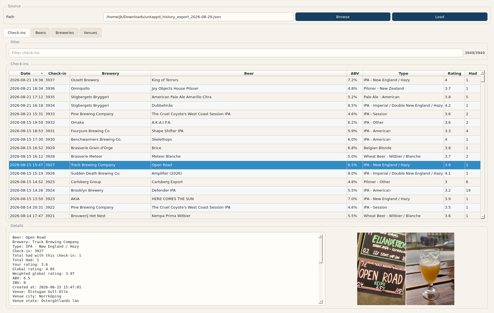
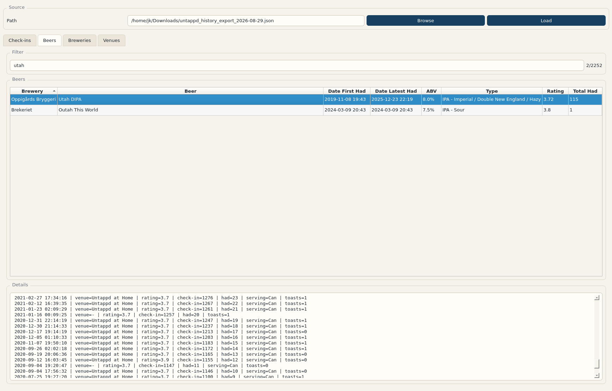
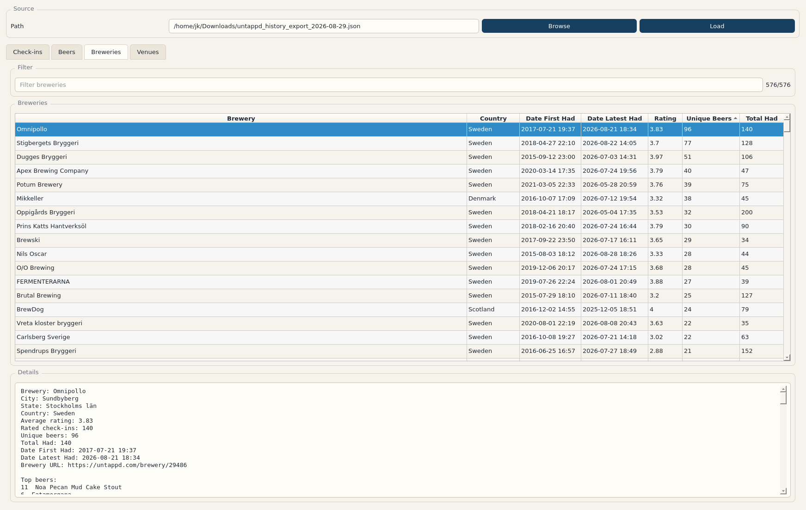

# Export Inspector

Local desktop and command-line tools for inspecting personal data exports.

The project started as a Facebook/Messenger export inspector and now also
includes tools for Gmail/Google Takeout mbox files, Untappd history exports, and
Runkeeper activity exports. It is designed for local use: point it at exports
you already downloaded, inspect/search them on your machine, and keep the raw
personal data out of this repository.

## Requirements

- Python 3.12 or newer.
- [`uv`](https://docs.astral.sh/uv/) is recommended for running the tools from a
  checkout.
- PySide6 is needed for the desktop GUI. The CLI tools are otherwise mostly
  standard-library Python.

## Quick Start

Clone the repo and run commands from the project directory:

```bash
git clone https://github.com/GoblinDynamiteer/site_export_inspector.git
cd site_export_inspector
uv run python untappd.py --help
```

To install editable command wrappers into a virtual environment instead:

```bash
python3.12 -m venv .venv
source .venv/bin/activate
pip install -e .
```

After installation, the console scripts are:

| Script | Purpose |
| --- | --- |
| `messenger-chat` | Render and search Facebook Messenger thread exports. |
| `google-mail` | Inspect, search, show, and index Gmail mbox exports. |
| `untappd-export` | Inspect, search, and show Untappd JSON check-ins. |
| `runkeeper-export` | Inspect, search, show, and map Runkeeper activity exports. |
| `export-inspector` | Launch the desktop GUI. |

The examples below use `uv run python <file>.py ...` so they work directly from
a checkout without installation.

## Untappd CLI

Untappd exports are JSON files containing check-in history.

Show summary stats and top lists:

```bash
uv run python untappd.py info ~/Downloads/untappd_history_export.json
```

Show a larger top-N report:

```bash
uv run python untappd.py info ~/Downloads/untappd_history_export.json --top 25
```

Focus the report on one beer or venue:

```bash
uv run python untappd.py info ~/Downloads/untappd_history_export.json --beer-count "Utah DIPA"
uv run python untappd.py info ~/Downloads/untappd_history_export.json --venue-count "Untappd at Home"
```

Search check-ins:

```bash
uv run python untappd.py search ~/Downloads/untappd_history_export.json "west coast" --limit 10
```

Filter and sort search results:

```bash
uv run python untappd.py search ~/Downloads/untappd_history_export.json \
  --brewery "Omnipollo" \
  --min-rating 4 \
  --sort rating-desc
```

Show one check-in in full. The identifier can be the check-in number printed by
`search` or a raw Untappd `checkin_id`.

```bash
uv run python untappd.py show ~/Downloads/untappd_history_export.json 3927
```

## Gmail CLI

Gmail exports usually come from Google Takeout as an `.mbox` file.

Show mailbox stats:

```bash
uv run python google_mail.py info ~/Downloads/Takeout/Mail/All\ mail\ Including\ Spam\ and\ Trash.mbox
```

Search a raw mbox:

```bash
uv run python google_mail.py search ~/Downloads/mail.mbox invoice --from example.com --limit 20
```

Build a SQLite full-text index for faster repeated searches:

```bash
uv run python google_mail.py index ~/Downloads/mail.mbox gmail_index.sqlite
```

Search the index:

```bash
uv run python google_mail.py search gmail_index.sqlite "renewal notice" --after 2024-01-01
```

Show a full message by the message index printed by `search`:

```bash
uv run python google_mail.py show gmail_index.sqlite 12345
```

Useful options include `--from`, `--to`, `--subject`, `--label`, `--after`,
`--before`, `--any`, `--headers-only`, `--timezone`, and `--no-ansi`.

## Runkeeper CLI

Runkeeper inputs can be either one export ZIP or a directory containing multiple
ZIP exports. Directory mode recursively loads `*.zip` files.

Show activity stats:

```bash
uv run python runkeeper.py info ~/Downloads/runkeeper-export.zip
uv run python runkeeper.py info ~/Downloads/runkeeper-exports/
```

Search activities:

```bash
uv run python runkeeper.py search ~/Downloads/runkeeper-exports/ run --after 2025-01-01
```

Filter by type, distance, duration, and sort order:

```bash
uv run python runkeeper.py search ~/Downloads/runkeeper-exports/ \
  --type Running \
  --min-distance 5 \
  --sort pace-asc
```

Show one activity by numeric index or GPX file name:

```bash
uv run python runkeeper.py show ~/Downloads/runkeeper-exports/ 42
uv run python runkeeper.py show ~/Downloads/runkeeper-exports/ 2026-04-22-072752.gpx
```

Generate an HTML activity map:

```bash
uv run python runkeeper.py map ~/Downloads/runkeeper-exports/ 42 -o runkeeper-map.html
```

Serve or open the map through local HTTP so map tiles load correctly:

```bash
uv run python runkeeper.py map ~/Downloads/runkeeper-exports/ 42 --serve
uv run python runkeeper.py map ~/Downloads/runkeeper-exports/ 42 --open
```

## Messenger CLI

Messenger input can be a single `message_*.json` file, a Facebook export ZIP, or
a directory containing JSON files and/or ZIPs.

Render a readable chat history:

```bash
uv run python show_messenger_chat.py ~/Downloads/facebook-export.zip
```

Show stats only:

```bash
uv run python show_messenger_chat.py ~/Downloads/facebook-export.zip --info
```

Search and filter by date:

```bash
uv run python show_messenger_chat.py ~/Downloads/facebook-export.zip \
  --search "project dinner" \
  --from 2022-01-01 \
  --until 2022-12-31
```

Write output to a text file:

```bash
uv run python show_messenger_chat.py ~/Downloads/facebook-export.zip -o chat.txt
```

Use `--pager` for interactive message-by-message reading, `--any` to match any
search term, `--gap-hours` to control gap markers, and `--no-ansi` to disable
terminal highlighting.

## Desktop GUI

Launch the GUI from a checkout:

```bash
uv run python -m export_inspector
```

Or, after installing the package:

```bash
export-inspector
```

The GUI includes tabs for supported export types. The Untappd tab can load a
JSON export, filter check-ins, inspect details, preview photos, and browse
aggregate views for beers, breweries, and venues.

### Untappd Check-ins



### Untappd Beers



### Untappd Breweries



## Data Privacy

Personal export files can contain highly sensitive data. Keep exports and
generated indexes out of git, especially:

- Facebook/Messenger ZIPs and extracted JSON files.
- Gmail `.mbox` files and generated SQLite indexes.
- Untappd JSON exports.
- Runkeeper ZIPs, GPX files, photos, and generated map files.

The tools are intended to run locally against files you provide. Do not commit
private exports or command output containing personal data.

## Troubleshooting

If `python3` fails with syntax or import errors, check the interpreter version:

```bash
python3 --version
uv run python --version
```

Use Python 3.12 or newer. Running through `uv run python ...` is usually the
simplest way to let `uv` select a compatible interpreter.

For command-specific options:

```bash
uv run python untappd.py --help
uv run python google_mail.py --help
uv run python runkeeper.py --help
uv run python show_messenger_chat.py --help
```
